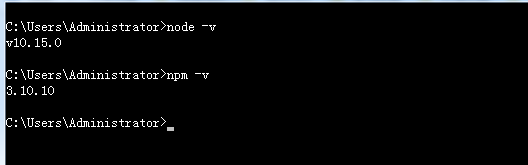
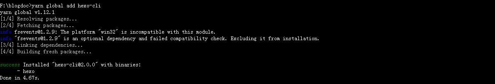
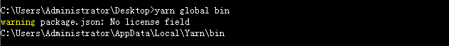
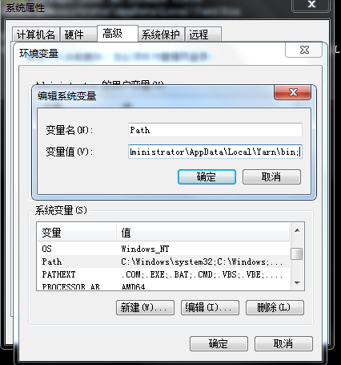
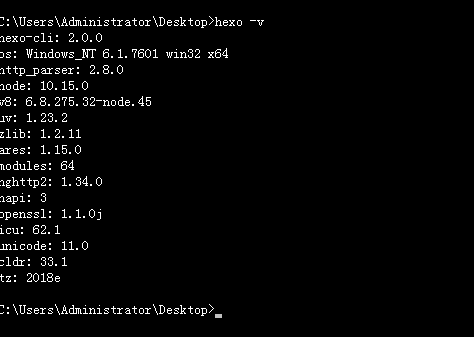
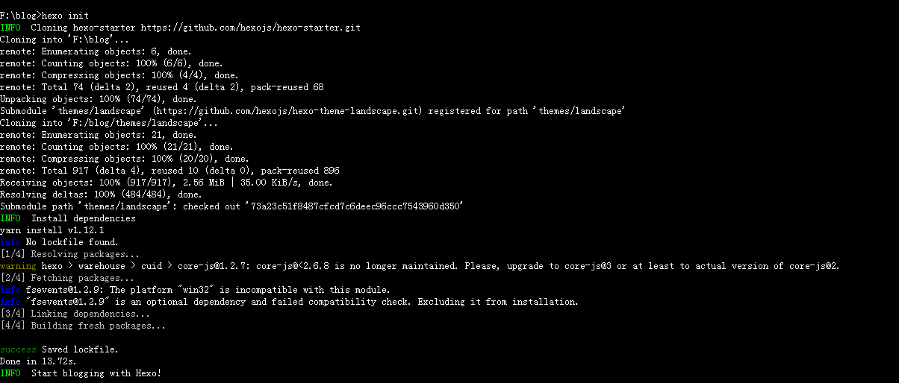
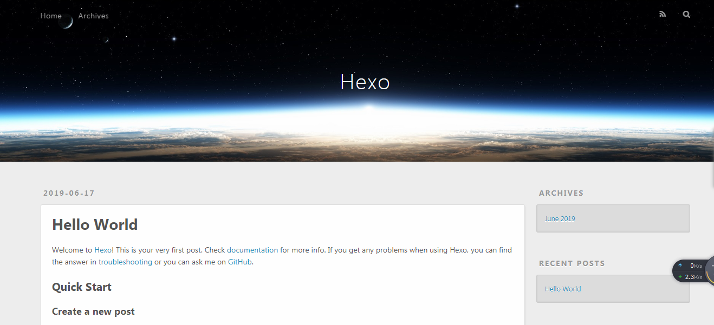
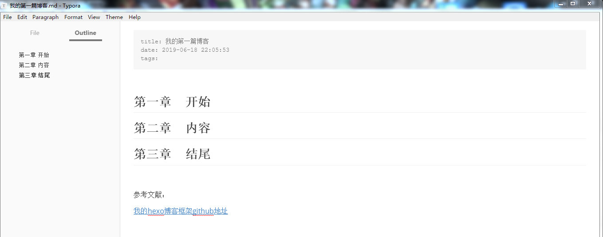

### ****从零开始搭建自己的个人博客--Hexo博客框架

​	每个程序员都应该有个自己的个人博客，这样更有IT范一些，哈哈。

​	搭建个人博客的框架有很多比如django、jeklly、hugo和Hexo等等，为啥向大家推荐Hexo，一是Hexo框架现如今很火，就是说“流行正时尚”，另一因素就是假如你在搭建博客框架的过程中出现各种各样的问题，它的网上的解决方案比较成熟，大神们讨论研究的东西也比较多，这对于咱们初入博客之门的大家来说还是非常友好的。

​	搭建个人博客的过程就和日常开发项目一样，肯定会出现各种各样的问题，咱们不要畏惧，大不了重来一次。

#### 第一步  下载安装[node.js](https://nodejs.org/en/)

1. 下载LTS稳定版的node.js;

2. 安装很简单，不停的下一步...;

3. 安装完后会有两个组件，一个是nodejs本省，还有一个就是npm包管理器;

4. 查看是否安装成功，打开cmd终端（按住shift+鼠标右键，选择‘在此处打开命令窗口’），输入node -v 和npm -v 查看版本，若是出现版本号则安装成功;

   

#### 第二步   全局安装hexo-cli博客框架

1. 由于国内下载npm包比较慢，而且`npm install`的时候**巨慢**,甚至同一个项目，安装的时候**无法保持一致性**(听说npm5.0在速度和使用上确实有了很大提升)等问题。一般都会使用cnpm或者yarn安装包，同时会使用**淘宝镜像源**。

2. 个人习惯用yarn安装，他有三个优点：

   ```
   1.npm安装是串行、而yarn是并行、速度快。
   2.已经下载过的包会被缓存、支持离线安装。
   3.优化的输出信息。
   ```

3. 终端输入命令：` npm  install -g  yarn`或者到[yarn官网](https://yarnpkg.com/zh-Hant/docs/install#windows-stable)下载安装，安装完成后，你可以测试下自己的版本 yarn --version

   再输入`yarn config set registry https://registry.npm.taobao.org`，安装成功会出现：

   

4. 全局安装hexo-cli,终端输入命令:`yarn global add hexo-cli`，安装成功会出现:


   

   当你输入hexo -v 查询hexo的版本会报错；

   

   原因是因为，咱们安装yarn是通过npm的方式安装(如果你是yarn官网下载msi文件，双击安装，安装成功后既可全局使用yarn命令，则不会出现该情况)，yarn的全局安装命令需要配置环境变量，在终端输入`yarn global bin`命令

   

   将该地址`C:\Users\Administrator\AppData\Local\Yarn\bin;`配置到系统变量内保存；

   

   然后重启命令行工具，输入hexo -v 出现下图则ok；

   

#### 第三步    开始使用Hexo搭建自己的博客

1. 先找个容量大点的盘（我是F盘）建一个blog文件夹，在此文件里打开终端，在该目录终端输入`hexo init`生成我们的博客，在一阵等待之后，就安装成功了；

   

2. hexo会在blog文件里生成一个基础的博客框架，后续咱们的开发都是在这个基础上开发；

3. 咱们现在运行下咱们的博客框架，运行非常简单，终端输入`hexo s`就启动了；

   

4. 然后打开启动成功的网址`http://localhost:4000`，就可以看到我们的博客雏形了。

   

5. 进入页面后会告诉你几个快速命令：

   - hexo new '我的新帖子
   - hexo server 运行服务器
   - hexo generate 生成静态文件
   - hexo deploy 部署到远程站点

#### 第四步    生成自己的第一个博客

1. 终端输入`hexo n "我的第一篇博客"`生成md文件,根据保存的路径找到该文件，用vscode或者typora等能编辑md格式文件的软件打开编辑；

   

2. 博主用的是typora，随便编辑了下内容，打开就是这个样子；

   

3.  然后保存文件退出软件，还是blog文件夹打开终端，在终端输入`hexo clean`清理下，输入`hexo g`生成文件，最后输入`hexo s` 生成服务;

   

4.  打开`http://localhost:4000/`你的第一篇博客就已经生成好了；

   

#### 第五步  将博客部署到github上公开使用

1. 打开个人的[github网站](https://github.com/),具体如何申请账号，百度下，网上一大堆；

2.  点击右上角+符号，点击`New repository`新建一个存储库，用户部署个人博客的github仓库命名必须符合特定的规范才行，为`你的用户名.github.io`,像博主的就`wangtengyz.github.io`,后续在浏览器输入这个地址就可以访问了；

   

   ​

   

3.  点击下面的创建按钮或者回车就创建好了；

   

4. 接下里，我们需要在blog文件夹下面装一个git部署的插件，终端输入`yarn add hexo-deployer-git` 安装;

   

5.  将blog文件夹里`_config.yml`文件用编辑器（vscode或者Notepad++等）打开，需要在打开改文档的最下方Deployment进行下配置；

   

   

   + type:git

   + repo:https://github.com/wangtengyz/wangtengyz.github.io.git(整个网站是你前面在github设置存储库的地址)

     

   + branch: master

     

6. 保存文件，退出编辑器，截下来就简单了，在终端输入`hexo d`部署到git远程站点上，记得你的github账号密码，在部署过程中他会要求你数入账号密码，输入成功后就部署上去了；

   

7.  最后输入`wangtengyz.github.io`（github用户名.github.io）,博客就成功的部署到gitub上了；

   

#### 第六步    如何更换博客主题

1. 一般都可以在网上找到很多各种各样的主题，博主在这里推荐一个github上用的很多的一个[主题](github.com/litten/hexo-theme-yilia)，地址`github.com/litten/hexo-theme-yilia`

2. 记住我们的所有的终端操作基本上都是在blog文件夹下面，在终端输入`git clone https://github.com/litten/hexo-theme-yilia.git themes/yilia`,将主题克隆岛blog文件下的theme文件的yilia文件里

3. 等主题下载后，打开blog文件夹里`_config.yml`文件，进行配置theme参数，将主题改成yilia；

   

4. 终端输入 `hexo clean`  `hexo g` `hexo s`三个命令，主题已经变成yilia；然后点击所有文章会出现一些问题，很简单，在终端输`npm i hexo-generator-json-content --save`,再打开blog文件夹里`_config.yml`文件添加配置就可以了；

   

   

   

5.  在终端重新输入 `hexo clean`  `hexo g` `hexo s`，打开本地`localhost:4000`查看网址就发现问题解决了；

6. 最后输入`hexo d` 推送到github上，打开`wangtengyz.github.io`(你就输入你的用户名)网址，看到最后效果了，大功告成；

   

7. 附上[源码地址](https://github.com/wangtengyz/wangtengyz.github.io)

   ​

   ​

   ​

   ​

   ​

   ​

   ​

#### 